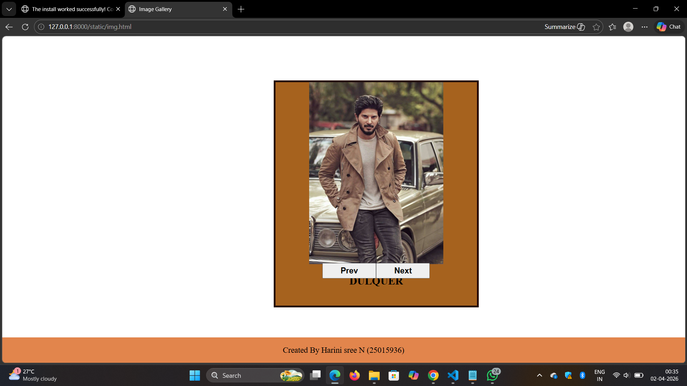
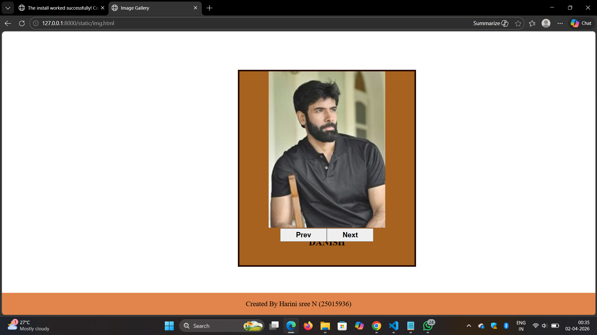
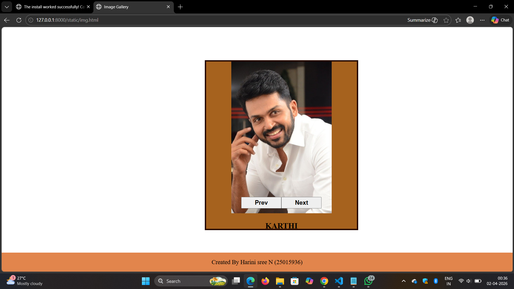
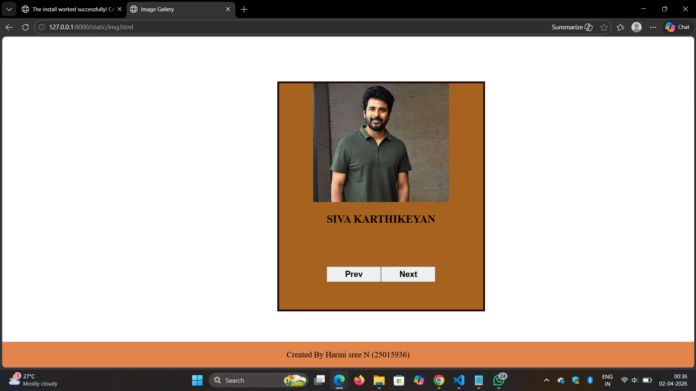
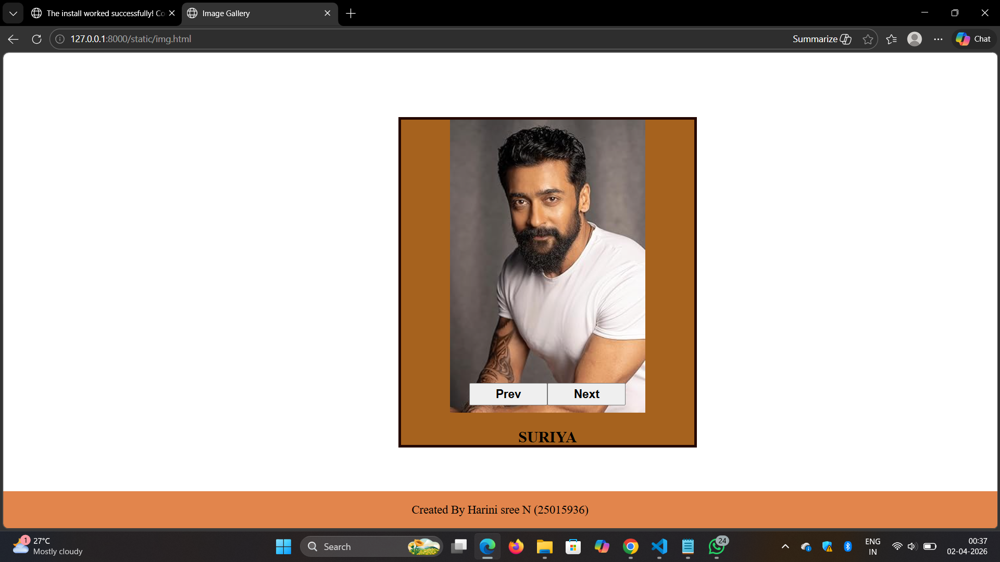

# Ex.07 Design of Interactive Image Gallery
## Date:01.04.2026

## AIM:
To design a web application for an inteactive image gallery for a minimum five images with next and previous buttons.

## DESIGN STEPS:

### Step 1:
Clone the github repository and create Django admin interface.

### Step 2:
Change settings.py file to allow request from all hosts.

### Step 3:
Use CSS for positioning and styling.

### Step 4:
Write JavaScript program for implementing interactivity.

### Step 5:
Validate the HTML and CSS code.

### Step 6:
Publish the website in the given URL.

## PROGRAM:
img.html:
```
<html>
    <head>
        <title>Image Gallery</title>
        <link href="img.css" rel="stylesheet">
        <script src="img.js"></script>
    </head>
    <body>
        <div class="container">
            <div class="box">
                
                <p id="caption">DULQUER</p>
            </div>
        
            <div class="buttons">
                <button onclick="prev()">Prev</input>
                <button onclick="next()">Next</input>
            </div>

        </div>
        <div class="footer">
            <p>Created By Harini sree N (25015936)</p>
        </div>
    </body>

</html>

```

img.css:
```

.container
{
    display:flex;
    align-items: center;    
    background-color: rgb(166, 98, 30);
    margin-top: 100px; 
    flex-direction: column;
    border:4px solid rgb(36, 8, 1);
    width:450;
    margin-left:600;
    height:500;
}
.box
{
    width:300px;
    height:300px;
}
.box p
{
    text-align:center;
    font-weight:bold;
    font-size:24;
}

.buttons
{
    padding: 10px;
    gap: 25px;             
}
button
{
    width: 120px;
    padding: 5px;
    font-size: 18px;
    font-weight: bold;
    margin-top:95px;
}

.footer 
{
    position:fixed;
    background-color: rgb(226, 133, 76);
    text-align: center;
    font-size: 18px;
    color:black;
    left:0;
    width:100%;
    bottom:0;
}
```

img.js:
```
        var img = [
    {image:"dulquer.jpg", caption:"DULQUER"},
    {image:"danish.jpg", caption:"DANISH"},
    {image:"karthi.jpg", caption:"KARTHI"},
    {image:"sk...jpg", caption:"SIVA KARTHIKEYAN"},
    {image:"suriya.jpg", caption:"SURIYA"},
];
var index=0;
function next()
{
    index++;
    if(index >= img.length)
        index = 0;
    document.getElementById("image").src = img[index].image;
    document.getElementById("caption").innerHTML= img[index].caption;
}

function prev()
{
    index--;
    if(index < 0)
        index = img.length - 1;
    document.getElementById("image").src = img[index].image;
    document.getElementById("caption").innerHTML= img[index].caption;
}
```

## OUTPUT:






## RESULT:
The program for designing an interactive image gallery using HTML, CSS and JavaScript is executed successfully.
